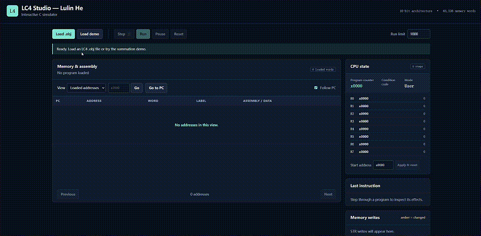

# Hi, I'm Lulin 👋

I'm an architect transitioning into software engineering,
currently studying computer science at the University of Pennsylvania.
I'm interested in systems, computer graphics, and interactive tools.

## SpeakEasy
### AI Voice Small-Talk Practice App

[![Watch the SpeakEasy demo]](https://youtu.be/BdcyFQ5QbK8)

A mobile app for English learners to practice realistic voice
conversations and receive personalized feedback.

**[Watch Demo](https://youtu.be/BdcyFQ5QbK8) |
[Code & Project Details](https://github.com/Bristenlin762/smalltalk)**

**My contributions**
- Proposed a dual-agent architecture separating live voice interaction
  from backend retrieval and evaluation.
- Integrated Groq and refined Google News retrieval and topic enrichment
  to provide richer context for the voice AI.
- Combined six rule-based scores with AI-generated coaching such as vocabulary, cultural clues and sentence upgrades.
- Created the demo narrative, hand-drawn storyboard, and animation concepts;
  produced and edited the final video.

**Technologies:** React Native · Expo · Node.js · Groq · Vapi

*Four-person Penn team project.
[Original repository](https://github.com/MaCanXH/smalltalk).*

## LC4 Studio
### Interactive CPU Simulator

A browser-based LC4 simulator that loads object files and lets users
inspect assembly instructions, step through execution, and observe
register and memory changes.

**[Watch Demo](https://youtu.be/KYXePN8_2tM) |
[Code & Project Details](https://github.com/Bristenlin762/lc4-studio)**

**My contributions**
- Extended my computer systems coursework into an interactive
  CPU simulator and debugging tool.
- Implemented a C execution core supporting arithmetic, logic,
  comparisons, branches, subroutine calls, and memory operations.
- Adapted object-file loading to populate CPU memory and display
  instruction disassembly and labels.
- Compiled the C core to WebAssembly for execution in the browser.
- Added step, run, pause, and reset controls, with register and
  memory change highlighting.

**Technologies:** C · WebAssembly · JavaScript · HTML · CSS

*Individual project inspired by computer systems coursework at Penn.*
